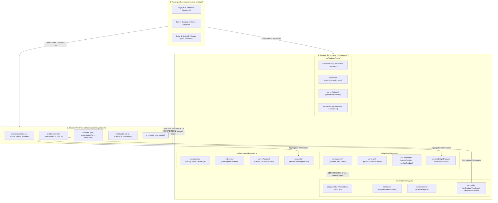

# Full-Stack Feature-Sliced Design (FSD) Specification

> **Master Architecture Specification & Governance Hub**  
> Adapted for Next.js 15 App Router, React Server Components (RSC), Server Actions, Drizzle ORM, Neon PostgreSQL, and Vercel Edge Runtime.

---

## 1. Executive Overview

This repository implements a **Full-Stack Adaptation of Feature-Sliced Design (FSD)** engineered specifically for modern Next.js 15 and above applications. Traditional frontend-only FSD paradigms focus solely on client UI components, leaving backend logic, database access, session authentication, caching, and server mutations disorganized.

Our full-stack architecture extends FSD across the entire software lifecycle—from edge network routing and React Server Component rendering down to database transactions and cache invalidation.

```
+-------------------------------------------------------------------------------+
|                             Next.js 15 App Router                            |
|             (Thin Routing, Page Composition, Layouts, Edge API Routes)         |
+---------------------------------------+---------------------------------------+
                                        |
                                        v
+---------------------------------------+---------------------------------------+
|                             Feature Slices Layer                              |
|   src/features/{analytics, products, subscriptions, users}/                   |
|   +-------------------+  +-------------------+  +-------------------------+  |
|   |    components/    |  |     schemas/      |  |         server/         |  |
|   | (RSC & Client UI) |  |   (Zod Schemas)   |  | actions/     db/        |  |
|   +-------------------+  +-------------------+  +-------------------------+  |
+---------------------------------------+---------------------------------------+
                                        |
                                        v
+---------------------------------------+---------------------------------------+
|                          Shared & Core Infrastructure                         |
|   src/{components/ui, data, drizzle, hooks, lib, server, tasks}/              |
|   +-------------------+  +-------------------+  +-------------------------+  |
|   |  Shadcn Primitives|  | Drizzle ORM / DB  |  | dbCache / Cache Engine  |  |
|   +-------------------+  +-------------------+  +-------------------------+  |
+-------------------------------------------------------------------------------+
```

### Core Architectural Values
- **Extreme Domain Locality**: All logic, UI, data access, mutations, and validation schemas for a domain live together within `src/features/[domain]/`.
- **Strict Unidirectional Dependency Graph**: Upper layers depend on lower layers; peer feature slices never import each other.
- **Three-Tier Server Layer**: Strict division between server mutations (`server/actions/`), cached queries/DB writes (`server/db/`), and cache infrastructure (`@/lib/cache.ts`).
- **Zero Barrel Leakage**: No `index.ts` barrel files inside features to prevent client/server boundary contamination and optimize tree-shaking.
- **Automated Boundary Governance**: Enforced via ESLint plugins (`eslint-plugin-boundaries` and `eslint-plugin-project-structure`).

---

## 2. High-Level Architecture & 3-Tier Layer Boundary

The system organizes code into three distinct vertical tiers with explicit dependency boundaries.

### 2.1 3-Tier Layer Boundary Diagram



### 2.2 Layer Hierarchy & Responsibilities

| Tier | Directory | Responsibilities | Allowed Imports | Forbidden Imports |
| :--- | :--- | :--- | :--- | :--- |
| **Tier 1: Routing** | [`src/app/`](file:///c:/projects/parity-deals-clone/src/app) | URL routing, page layouts, RSC data orchestration, metadata, Edge API handlers. | Feature slices (`src/features/*`), Shared (`src/*`). | Must NOT contain internal business logic or raw SQL. |
| **Tier 2: Features** | [`src/features/*`](file:///c:/projects/parity-deals-clone/src/features) | Business domains (`products`, `analytics`, `subscriptions`, `users`). Contains UI, Zod schemas, Server Actions, and cached DB queries. | Own feature family, Shared (`src/*`). | Must NOT import peer features (`src/features/<other>/*`). |
| **Tier 3: Shared** | [`src/components/`](file:///c:/projects/parity-deals-clone/src/components), [`src/lib/`](file:///c:/projects/parity-deals-clone/src/lib), [`src/drizzle/`](file:///c:/projects/parity-deals-clone/src/drizzle), [`src/data/`](file:///c:/projects/parity-deals-clone/src/data) | Reusable UI primitives, DB connection, Drizzle schema, caching engine, formatting, permissions. | Other shared modules within Tier 3. | Must NOT import from `src/app/` or `src/features/*` (with explicit exception for [`src/lib/permissions.ts`](file:///c:/projects/parity-deals-clone/src/lib/permissions.ts)). |

---

## 3. The 4 Core Laws of Full-Stack FSD

To maintain architectural integrity across dozens of contributors and evolving features, four non-negotiable laws govern this codebase:

```
+-------------------------------------------------------------------------------+
|                       THE 4 CORE LAWS OF FULL-STACK FSD                       |
+-------------------------------------------------------------------------------+
|  1. LAW OF DOMAIN-SLICE ISOLATION                                             |
|     Every domain entity lives in src/features/[domain]/ containing all UI,    |
|     schemas, actions, and DB queries necessary for self-sufficiency.          |
+-------------------------------------------------------------------------------+
|  2. LAW OF ZERO CROSS-FEATURE IMPORTS                                         |
|     Feature slices are strictly isolated. Peer features cannot import each    |
|     other. Cross-domain coordination belongs in Tier 1 or Shared Aggregators. |
+-------------------------------------------------------------------------------+
|  3. LAW OF THREE-TIER SERVER SEPARATION                                       |
|     server/actions/ (mutations/auth) is decoupled from server/db/ (cached     |
|     queries/writes) and lib/cache.ts (caching engine & tag revalidation).     |
+-------------------------------------------------------------------------------+
|  4. LAW OF THIN ROUTING                                                       |
|     Route files in src/app/ only assemble components and initiate data        |
|     fetching. No direct database access or business logic in page.tsx.        |
+-------------------------------------------------------------------------------+
```

### Law 1: Law of Domain-Slice Isolation
Each business domain resides inside its own folder under [`src/features/[domain]/`](file:///c:/projects/parity-deals-clone/src/features). A feature slice is completely self-contained, encapsulating its domain components, Zod validation schemas, Next.js Server Actions, and Drizzle DB queries.

### Law 2: Law of Zero Cross-Feature Imports
Peer feature slices cannot import symbols from other feature slices:
```typescript
// ❌ FORBIDDEN (eslint boundaries violation):
import { getUserSubscriptionTier } from "@/features/subscriptions/server/db/subscription" // inside src/features/products/server/actions/products.ts

// ✅ REQUIRED (Use Shared Permission Aggregator or Route Composition):
import { canCreateProduct } from "@/lib/permissions"
```
When multiple features must interact, composition occurs at **Tier 1 (Routing)** or through specialized **Tier 3 (Shared Aggregators)** such as [`src/lib/permissions.ts`](file:///c:/projects/parity-deals-clone/src/lib/permissions.ts).

### Law 3: Law of Three-Tier Server Separation
Server-side logic is strictly partitioned into three specialized sub-layers:
1. **Mutations & Auth Layer (`server/actions/`)**: Marked with `"use server"`. Responsible for session extraction via Clerk `auth()`, Zod payload parsing via `safeParse()`, subscription permission verification, calling DB mutation helpers, and triggering cache invalidation.
2. **Database Access Layer (`server/db/`)**: Contains pure Drizzle ORM operations. Read queries are wrapped with `dbCache()` and tag configurations; write queries execute SQL operations and handle transactions/batches.
3. **Caching & Revalidation Layer (`@/lib/cache.ts`)**: Centralizes the `dbCache` higher-order wrapper (combining React `cache()` and Next.js `unstable_cache()`) and `revalidateDbCache()` tag invalidation taxonomy.

### Law 4: Law of Thin Routing
Files inside [`src/app/`](file:///c:/projects/parity-deals-clone/src/app) (`page.tsx`, `layout.tsx`, `route.ts`) are declarative composition roots. They:
- Extract URL params and search params.
- Invoke cached feature queries (`getProducts(userId)`).
- Pass data as props into feature components (`<ProductGrid products={products} />`).
- Manage layouts, page metadata, and error boundaries.

---

## 4. Hub-and-Spoke Navigation Matrix

Explore the comprehensive documentation suite across the 8 dedicated technical chapters:

| # | Chapter | Key Focus Areas & Architectural Patterns | Target Audience |
| :---: | :--- | :--- | :--- |
| **01** | [**Directory & Layer Matrix**](file:///c:/projects/parity-deals-clone/docs/fsd/01-directory-and-layer-matrix.md) | Full annotated `src/` tree, feature anatomy, banned `services/` & `validations/` folders, Promotion Lifecycle. | All Developers / Architects |
| **02** | [**Server Layer & RSC Actions**](file:///c:/projects/parity-deals-clone/docs/fsd/02-server-layer-and-rsc-actions.md) | 6-step Action lifecycle, Clerk `auth()`, direct imports vs barrel hazards, Edge API banner route. | Full-Stack Engineers |
| **03** | [**DB Caching & Drizzle Patterns**](file:///c:/projects/parity-deals-clone/docs/fsd/03-db-caching-and-drizzle-patterns.md) | Dual-tier caching (`React cache` + `unstable_cache`), tag taxonomies, `db.batch()` transactional upserts. | Backend / DB Engineers |
| **04** | [**Forms, Zod & UI Patterns**](file:///c:/projects/parity-deals-clone/docs/fsd/04-forms-zod-and-ui-patterns.md) | React Hook Form, Shadcn UI integration, schema sharing, `useTransition` pending states, toast alerts. | Frontend Engineers |
| **05** | [**ESLint Boundaries & Governance**](file:///c:/projects/parity-deals-clone/docs/fsd/05-eslint-boundaries-and-governance.md) | Rule definitions in `.eslintrc.json` & `independentModules.jsonc`, CI gates, automated boundary enforcement. | DevOps / Lead Engineers |
| **06** | [**Webhooks & Third-Party Sync**](file:///c:/projects/parity-deals-clone/docs/fsd/06-webhooks-and-third-party-sync.md) | Stripe & Clerk webhook verification, Svix signature checks, idempotent event handling, cache purges. | Backend Engineers |
| **07** | [**Analytics & Aggregations**](file:///c:/projects/parity-deals-clone/docs/fsd/07-analytics-and-aggregations.md) | Time-series charting, SQL `count()` & date-bucket aggregation queries, chart formatting, edge views. | Full-Stack Engineers |
| **08** | [**Migration & Refactor Runbook**](file:///c:/projects/parity-deals-clone/docs/fsd/08-migration-and-refactor-runbook.md) | Step-by-step extraction guide, before/after code refactor examples, anti-pattern remediation. | Tech Leads / Migrators |

---

## 5. Architectural Invariants & Governance Summary

```
                      +-----------------------------+
                      |       Boundary Matrix       |
                      +-----------------------------+
                      | Can src/app import:         |
                      |   - src/features/*   -> YES |
                      |   - src/components/* -> YES |
                      |   - src/lib/*        -> YES |
                      |                             |
                      | Can src/features/A import:  |
                      |   - src/features/A/* -> YES |
                      |   - src/features/B/* -> NO  |
                      |   - src/lib/*        -> YES |
                      |   - src/drizzle/*    -> YES |
                      |                             |
                      | Can src/components import:  |
                      |   - src/features/*   -> NO  |
                      |   - src/app/*        -> NO  |
                      |   - src/lib/*        -> YES |
                      +-----------------------------+
```

To verify boundary integrity at any time, run:
```bash
npm run lint
```
Any violation of layer isolation, barrel usage, or cross-feature imports triggers an immediate build failure.

---

[Start Reading: Chapter 01: Directory & Layer Matrix →](file:///c:/projects/parity-deals-clone/docs/fsd/01-directory-and-layer-matrix.md)
