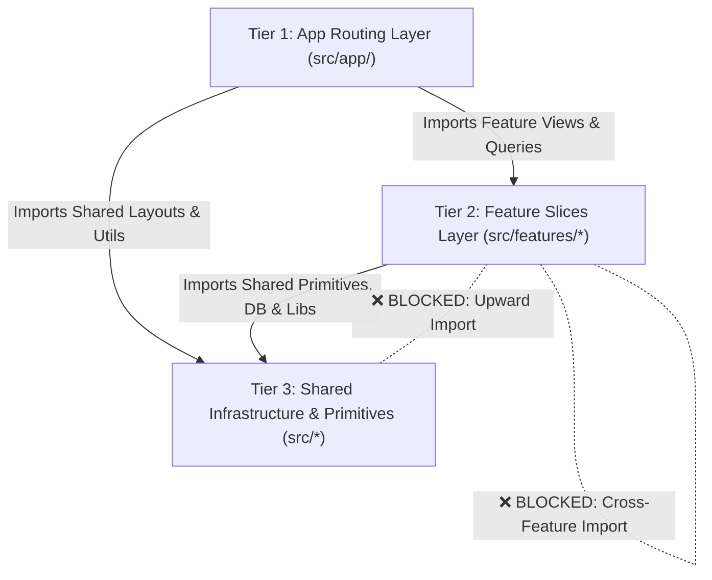
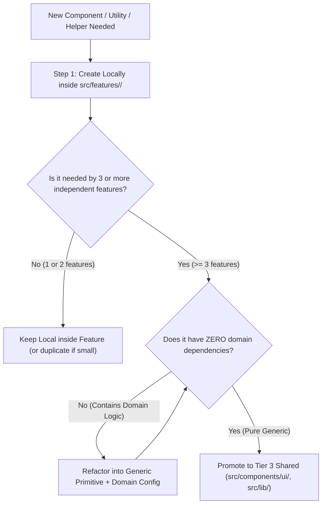

[Master FSD Index](../FEATURE-SLICED-DESIGN.md) > Chapter 01: Directory & Layer Matrix

# Chapter 01: Directory Taxonomy & Layer Rules

This chapter provides the complete directory taxonomy, layer hierarchy, and import boundaries for the **Full-Stack Feature-Sliced Design (FSD)** architecture implemented across the application.

---

## 1. Overview & Architectural Topology

Traditional software architectures (such as standard MVC or flat component trees) struggle with Next.js 15 App Router applications. They frequently cause:
- Uncontrolled server-code leakage into client bundles.
- Hidden circular dependencies.
- Monolithic services mixing read queries, write mutations, validation, and session auth.
- Disorganized feature logic scattered across global folders.

To resolve this, our codebase organizes all logic into three vertical layers with strict, unidirectional boundary rules:



---

## 2. Complete Annotated `src/` File Tree

Below is the complete file tree of [`src/`](file:///c:/projects/parity-deals-clone/src), showing the 10 root directories and their organizational responsibilities.

```
src/
├── app/                               # TIER 1: Next.js App Router (Routes, Pages, Layouts, APIs)
│   ├── (auth)/                        # Authentication route group (sign-in, sign-up)
│   ├── (marketing)/                   # Public marketing landing pages & pricing tables
│   ├── api/                           # Public API & Webhook endpoints
│   │   ├── products/[productId]/      # Edge API routes (e.g. banner embed script generation)
│   │   │   └── banner/route.ts
│   │   └── webhooks/                  # Third-party webhook handlers (Clerk, Stripe)
│   │       ├── clerk/route.ts
│   │       └── stripe/route.ts
│   ├── dashboard/                     # Authenticated dashboard pages (products, analytics, subscription)
│   │   ├── layout.tsx                 # Dashboard root layout with navigation
│   │   ├── page.tsx                   # Products dashboard overview page
│   │   ├── analytics/page.tsx         # Analytics charts & reporting page
│   │   ├── products/                  # Product management sub-routes (new, edit)
│   │   └── subscription/page.tsx      # Subscription management & upgrade tier page
│   ├── fonts/                         # Custom web fonts
│   ├── globals.css                    # Global Tailwind CSS and design tokens
│   ├── layout.tsx                     # Root application HTML shell & ClerkProvider wrapper
│   └── middleware.ts                  # Global edge routing & Clerk authentication middleware
│
├── components/                        # TIER 3: Shared Reusable UI Components & Primitives
│   ├── ui/                            # Shadcn UI primitives (Button, Card, Dialog, Input, etc.)
│   ├── icons/                         # Shared SVG icon components
│   ├── Banner.tsx                     # Shared banner preview component
│   ├── BrandLogo.tsx                  # Global SVG brand identity
│   ├── DashboardNavBar.tsx            # Authenticated application top navigation bar
│   ├── HasPermission.tsx              # Generic RBAC / subscription permission guard wrapper
│   ├── MarketingNavBar.tsx            # Public marketing header navigation
│   ├── NoPermissionCard.tsx           # Shared upgrade fallback card for locked features
│   ├── PageWithBackButton.tsx         # Page wrapper with animated back button navigation
│   └── RequiredLabelIcon.tsx          # Form field required asterisk indicator
│
├── data/                              # TIER 3: Global Static Data & Environment Variables
│   ├── env/                           # Type-safe environment variable schemas (@t3-oss/env-nextjs)
│   │   ├── client.ts                  # Public NEXT_PUBLIC_* environment configuration
│   │   └── server.ts                  # Private server-only secrets (DB URLs, Stripe/Clerk keys)
│   ├── countriesByDiscount.json       # Static ISO country code to PPP discount group mapping
│   └── subscriptionTiers.ts           # Tier definitions, limits, and pricing metadata
│
├── drizzle/                           # TIER 3: Database Client, Schema & SQL Migrations
│   ├── db.ts                          # Neon PostgreSQL HTTP connection client instance
│   ├── schema.ts                      # Drizzle ORM PostgreSQL relational table definitions & relations
│   └── migrations/                    # Auto-generated SQL migration files
│
├── features/                          # TIER 2: Isolated Domain Feature Slices
│   ├── analytics/                     # Analytics domain: Views tracking, charts, aggregations
│   ├── products/                      # Products domain: Product CRUD, country discounts, customization
│   ├── subscriptions/                 # Subscriptions domain: Stripe checkout, tier validation, portal
│   └── users/                         # Users domain: User profile management & Clerk webhooks
│
├── hooks/                             # TIER 3: Shared Cross-Cutting React Hooks
│   └── use-toast.ts                   # Global toast notification hook
│
├── lib/                               # TIER 3: Shared Utilities, Caching Engine & Aggregators
│   ├── cache.ts                       # Dual-tier cache engine (React cache + unstable_cache) & tags
│   ├── formatters.ts                  # Shared number, currency, and date formatters
│   ├── permissions.ts                 # Shared Permission Aggregator across feature DB queries
│   └── utils.ts                       # Class merging (clsx + tailwind-merge) & string utilities
│
├── schemas/                           # TIER 3: Shared Global Validation Schemas (Promoted Schemas)
│
├── server/                            # TIER 3: Shared Server Infrastructure & Base Query Helpers
│   ├── actions/                       # Global server actions (if promoted across all domains)
│   └── db/                            # Global database utility helpers
│
└── tasks/                             # Standalone Cron Scripts & Maintenance CLI Tools
    └── updateCountryGroups.ts         # Maintenance script syncing country PPP discount groups
```

### Directory Governance Matrix

| Directory | Layer | Scope | Allowed Inbound Callers | Allowed Outbound Dependencies |
| :--- | :--- | :--- | :--- | :--- |
| [`src/app/`](file:///c:/projects/parity-deals-clone/src/app) | Tier 1 (Routing) | Global | Next.js Router Engine | `src/features/*`, `src/components/*`, `src/lib/*`, `src/data/*` |
| [`src/features/*`](file:///c:/projects/parity-deals-clone/src/features) | Tier 2 (Features) | Domain-Isolated | `src/app/*`, `src/lib/permissions.ts` (DB only) | Own feature slice, `src/components/*`, `src/lib/*`, `src/drizzle/*`, `src/data/*` |
| [`src/components/`](file:///c:/projects/parity-deals-clone/src/components) | Tier 3 (Shared UI) | Global | `src/app/*`, `src/features/*` | `src/lib/*`, `src/data/*`, other `src/components/*` |
| [`src/lib/`](file:///c:/projects/parity-deals-clone/src/lib) | Tier 3 (Shared Core) | Global | `src/app/*`, `src/features/*`, `src/components/*` | `src/drizzle/*`, `src/data/*` (Exception: `permissions.ts` can import `features/**/db`) |
| [`src/drizzle/`](file:///c:/projects/parity-deals-clone/src/drizzle) | Tier 3 (Database) | Global | `src/features/**/server/db/*`, `src/tasks/*` | `src/data/*`, `drizzle-orm` |
| [`src/data/`](file:///c:/projects/parity-deals-clone/src/data) | Tier 3 (Data/Env) | Global | All layers | Zero internal dependencies |
| [`src/tasks/`](file:///c:/projects/parity-deals-clone/src/tasks) | CLI / Crons | Standalone | CLI execution runner | `src/drizzle/*`, `src/data/*` |

---

## 3. Feature Folder Anatomy & Taxonomy

Every domain slice inside [`src/features/<feature>/`](file:///c:/projects/parity-deals-clone/src/features) follows a uniform internal file taxonomy.

```
src/features/[feature-name]/
├── components/                        # Feature UI: React Server & Client Components
│   ├── ProductForm.tsx                # Client form component with react-hook-form
│   ├── ProductGrid.tsx                # Server Component rendering product cards
│   ├── ProductCustomizationForm.tsx   # Banner styling configuration controls
│   └── CountryDiscountsForm.tsx       # Tabular PPP discount management table
│
├── schemas/                           # Zod Schemas & Inferred TypeScript Types
│   └── products.ts                    # productDetailsSchema, productCustomizationSchema
│
├── server/                            # Server-Side Business Logic & Data Access
│   ├── actions/                       # Next.js Server Actions ("use server")
│   │   └── products.ts                # createProduct, updateProduct, deleteProduct
│   └── db/                            # Drizzle DB Access & Dual-Tier Caching
│       └── products.ts                # getProduct, getProducts, updateProductDb
│
├── hooks/                             # (Optional) Feature-Specific React Hooks
│   └── useProductFilter.ts            # Client-side search and filtering hook
│
├── utils/                             # (Optional) Feature-Specific Pure Utilities
│   └── calculateSavings.ts            # Domain calculation algorithms
│
├── types/                             # (Optional) Pure Type Definitions (when not in schemas/)
│   └── index.ts                       # Domain interfaces and union types
│
├── data/                              # (Optional) Feature-Specific Mock Data / Fixtures
│   └── defaultCustomization.ts        # Default styling state for new banners
│
└── constants/                         # (Optional) Feature-Specific Immutable Constants
    └── limits.ts                      # Max discount rates, field lengths
```

### 3.1 Responsibilities by Subfolder

#### `components/`
- Contains both React Server Components (RSC) and Client Components (`"use client"`).
- Responsible for rendering domain views, handling user interaction, and binding forms to Server Actions.
- May import UI primitives from [`src/components/ui/`](file:///c:/projects/parity-deals-clone/src/components/ui) and schemas from local `schemas/`.
- Must NOT directly execute database queries or call Drizzle ORM.

#### `schemas/`
- Contains all domain [Zod](https://zod.dev) validation schemas.
- Exports both the runtime Zod schema object and inferred TypeScript types using `z.infer<typeof schema>`.
- Shared symmetrically between client form components (`components/`) and server actions (`server/actions/`).

#### `server/actions/`
- Contains Next.js Server Actions marked with `"use server"`.
- Performs the 6-step mutation lifecycle: session auth (`auth()`), payload validation (`safeParse()`), permission checks (`canCreateProduct()`), database execution (`server/db/`), and cache invalidation (`revalidateDbCache()`).

#### `server/db/`
- Contains pure Drizzle ORM query and mutation functions.
- Read operations are wrapped in `dbCache()` with explicit cache tags (`getIdTag`, `getUserTag`, `getGlobalTag`).
- Write operations execute SQL inserts/updates/deletes/batches and trigger `revalidateDbCache()`.

---

## 4. Banned Architectural Anti-Patterns

To maintain clean code quality and prevent common Next.js pitfalls, four specific folder patterns and practices are **strictly forbidden**:

```
+-------------------------------------------------------------------------------+
|                         BANNED ARCHITECTURAL PATTERNS                         |
+-------------------------------------------------------------------------------+
|  ❌ BANNED: src/features/*/services/                                          |
|     Reason: Fat service classes blur mutation/query boundaries, hide          |
|     "use server" directives, and destroy RSC streaming capabilities.          |
+-------------------------------------------------------------------------------+
|  ❌ BANNED: src/features/*/validations/                                       |
|     Reason: Redundant terminology. Zod schemas provide both runtime           |
|     validation and static type inference; use schemas/ consistently.          |
+-------------------------------------------------------------------------------+
|  ❌ BANNED: src/features/*/index.ts (Barrel Exports)                          |
|     Reason: Server code leakage into client bundles, broken tree-shaking,     |
|     and circular dependency cycles. Direct imports are mandatory.             |
+-------------------------------------------------------------------------------+
|  ❌ BANNED: Cross-Feature Imports (Peer-to-Peer)                              |
|     Reason: Destroys modularity and creates tight architectural coupling.     |
+-------------------------------------------------------------------------------+
```

### 4.1 Why `services/` is Banned
In traditional enterprise backend frameworks (NestJS, Spring Boot), a `services/` directory holds fat class instances containing all business operations. In Next.js 15 FSD, this is an anti-pattern:
1. **Loss of Server-Boundary Clarity**: Next.js requires explicit separation between mutations (`"use server"` Server Actions invoked from client forms) and read queries (executed in RSCs). A combined service class obscures which methods are public RPC endpoints and which are private DB queries.
2. **Bundle Bloat**: If a client component imports a method from a shared service file, the bundler may bundle heavy backend dependencies (Drizzle, database drivers) into the browser payload.
3. **Impediment to Streaming**: RSC data loading works best with small, focused async functions that stream independently via `<Suspense>`.

**Correct Replacement**: Split all functionality cleanly into `server/actions/` (mutations) and `server/db/` (cached queries).

### 4.2 Why `validations/` is Banned
Some developers create a `validations/` folder alongside a `types/` folder. In our modern TypeScript + Zod stack, this creates needless fragmentation:
1. **Redundant Duplication**: Defining an interface in `types/user.ts` and a validator in `validations/user.ts` requires maintaining two parallel type structures.
2. **Standardized FSD Taxonomy**: `schemas/` is the single authoritative location for Zod schemas. The static TypeScript type is derived directly via `export type ProductDetails = z.infer<typeof productDetailsSchema>`.

**Correct Replacement**: Consolidate all Zod definitions and inferred types in `schemas/`.

### 4.3 Why Barrel Files (`index.ts`) are Banned
Exporting all feature symbols through a root `index.ts` barrel file creates critical risks in Next.js:
- **Server Code Leakage**: A client component importing a small helper from `@/features/products` inadvertently pulls `"use server"` action entry points or Drizzle queries into the client compilation graph.
- **Degraded Build Performance**: Turbopack and Webpack must parse the entire module graph of the barrel export for every consuming file.

**Correct Replacement**: Always use explicit direct file imports:
```typescript
// ✅ CORRECT: Direct file imports
import { ProductForm } from "@/features/products/components/ProductForm"
import { getProduct } from "@/features/products/server/db/products"
import { createProduct } from "@/features/products/server/actions/products"
```

---

## 5. The Rule of Promotion (Local-First Lifecycle)

To prevent the shared layers ([`src/components/`](file:///c:/projects/parity-deals-clone/src/components), [`src/lib/`](file:///c:/projects/parity-deals-clone/src/lib), [`src/schemas/`](file:///c:/projects/parity-deals-clone/src/schemas)) from becoming dumping grounds for premature abstractions, all code follows the **Local-First Lifecycle**.

### 5.1 The Rule of Three (Promotion Criteria)



### 5.2 The 3 Core Promotion Tests

1. **The 3-Consumer Threshold**: Code remains local to a feature until at least 3 distinct domains require the exact same functionality.
2. **The Domain Independence Test**: A promoted component or utility must have **zero imports** from any `src/features/*` directory. It must accept all data through generic props or parameters.
3. **The Stability Invariant**: Promoted code must have a stable API contract that changes infrequently.

### 5.3 Promotion Matrix by Artifact Type

| Local Origin | Shared Destination | Promotion Pre-requisites | Example |
| :--- | :--- | :--- | :--- |
| `features/*/components/` | [`src/components/ui/`](file:///c:/projects/parity-deals-clone/src/components/ui) or [`src/components/`](file:///c:/projects/parity-deals-clone/src/components) | Strip domain props; accept generic children, classNames, or primitives. | `src/features/products/components/Banner.tsx` promoted to `src/components/Banner.tsx` |
| `features/*/utils/` | [`src/lib/`](file:///c:/projects/parity-deals-clone/src/lib) | Pure functions with zero side effects or domain knowledge. | Number formatting helper promoted to `src/lib/formatters.ts` |
| `features/*/schemas/` | [`src/schemas/`](file:///c:/projects/parity-deals-clone/src/schemas) | Generic payload schemas reused across multiple API webhooks or auth flows. | Global pagination or ID parameter schemas |
| `features/*/server/db/` | [`src/lib/permissions.ts`](file:///c:/projects/parity-deals-clone/src/lib/permissions.ts) | Cross-cutting permission or capability checks requiring multi-domain DB counts. | `canCreateProduct(userId)` aggregating product counts and tier limits |

---

## 6. Summary of Architectural Rules

```
+-------------------------------------------------------------------------------+
|                            LAYER RULES SUMMARY                                |
+-------------------------------------------------------------------------------+
| 1. App layer (src/app/) composes features and handles routing.                |
| 2. Feature slices (src/features/*) contain domain components, schemas,        |
|    Server Actions, and cached DB queries.                                     |
| 3. Feature slices NEVER import from peer feature slices.                      |
| 4. Shared layers (src/components, src/lib, src/drizzle) NEVER import from    |
|    features (except src/lib/permissions.ts for DB aggregation).               |
| 5. Direct file imports are required everywhere. No barrel files (index.ts).   |
+-------------------------------------------------------------------------------+
```

---

Next: [Chapter 02: Server Layer & RSC Actions](./02-server-layer-and-rsc-actions.md) →
