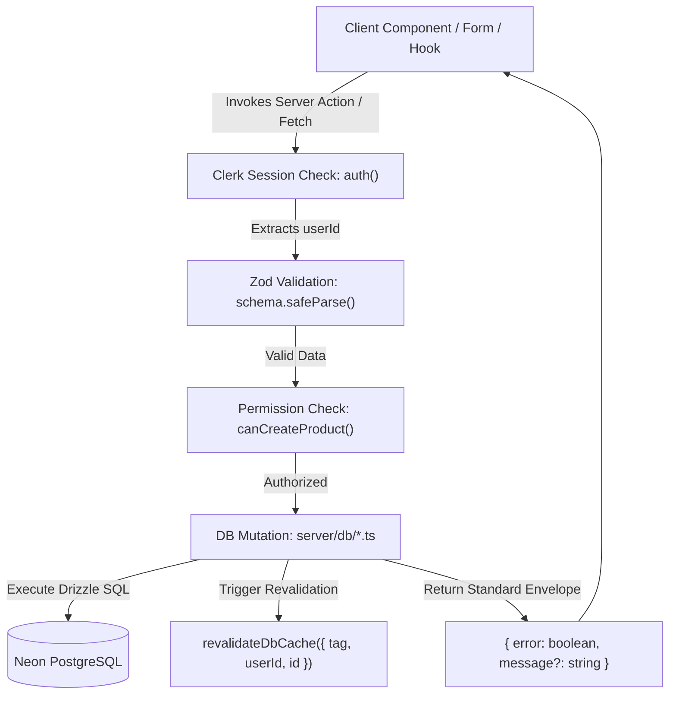

# Chapter 02: Server Layer & RSC Actions

[Master FSD Index](../FEATURE-SLICED-DESIGN.md) > Chapter 02: Server Layer & RSC Actions

---

## 1. Overview & Architectural Role

In this architecture, the **Server Layer** serves as the authoritative boundary for business logic, data mutations, session authentication, and permission enforcement. Server actions (`"use server"`) and API routes bridge client components and server-rendered views with the underlying PostgreSQL database (via Drizzle ORM).



---

## 2. Next.js Server Actions (`"use server"`)

Every mutation executed by the client is routed through an explicit Server Action located within the feature slice at `src/features/<feature>/server/actions/<action-group>.ts`.

### 2.1 The Standard Server Action Lifecycle

Every Server Action strictly adheres to a deterministic 6-step execution lifecycle:

1. **Directive Declaration**: Starts with `"use server"` at the top of the file.
2. **Session Authentication**: Retrieves `userId` via `@clerk/nextjs/server`'s `auth()`. Rejects immediately if `userId == null`.
3. **Input Parsing & Validation**: Validates untrusted payload using `schema.safeParse(unsafeData)`. Never trusts client-side type assumptions.
4. **Business Permission Verification**: Queries subscription limits or capability guards (e.g., `canCreateProduct(userId)`, `canCustomizeBanner(userId)`).
5. **Database Mutation Execution**: Calls dedicated internal database mutation functions from `@/features/<feature>/server/db/<feature>` (e.g., `createProductDb`, `updateProductDb`).
6. **Cache Invalidation & Response**: Triggers `revalidateDbCache()` and either redirects or returns a typed mutation response envelope.

### 2.2 Standard Mutation Response Envelope

Server actions return either an error/status response envelope or trigger a server-side redirect:

```typescript
// Type signature for stateful mutation actions
export type ActionResponse<T = unknown> = Promise<
  { error: boolean; message: string; data?: T } | undefined
>
```

- When mutations fail validation or authentication, they return `{ error: true, message: "..." }`.
- When mutations succeed and do not redirect, they return `{ error: false, message: "..." }`.
- When mutations trigger navigation (e.g., product creation redirecting to the country discount tab), Next.js `redirect()` throws its internal control flow exception and halts execution cleanly.

### 2.3 Reference Implementation: `products.ts`

Below is the verbatim implementation from [`src/features/products/server/actions/products.ts`](file:///c:/projects/parity-deals-clone/src/features/products/server/actions/products.ts#L20-L55):

```typescript
export async function createProduct(
  unsafeData: z.infer<typeof productDetailsSchema>
): Promise<{ error: boolean; message: string } | undefined> {
  const { userId } = auth()
  const { success, data } = productDetailsSchema.safeParse(unsafeData)
  const canCreate = await canCreateProduct(userId)

  if (!success || userId == null || !canCreate) {
    return { error: true, message: "There was an error creating your product" }
  }

  const { id } = await createProductDb({ ...data, clerkUserId: userId })

  redirect(`/dashboard/products/${id}/edit?tab=countries`)
}

export async function updateProduct(
  id: string,
  unsafeData: z.infer<typeof productDetailsSchema>
): Promise<{ error: boolean; message: string } | undefined> {
  const { userId } = auth()
  const { success, data } = productDetailsSchema.safeParse(unsafeData)
  const errorMessage = "There was an error updating your product"

  if (!success || userId == null) {
    return { error: true, message: errorMessage }
  }

  const isSuccess = await updateProductDb(data, { id, userId })

  return {
    error: !isSuccess,
    message: isSuccess ? "Product details updated" : errorMessage,
  }
}
```

---

## 3. The Direct File Import Rule vs Barrel Export Leakage

### 3.1 The Risk of Barrel Exports (`index.ts`)

A classic antipattern in modular architectures is creating a centralized barrel export (`index.ts`) in the root of a feature directory:

```typescript
// ❌ FORBIDDEN: src/features/products/index.ts (Barrel Export)
export * from "./components/ProductCard"
export * from "./server/actions/products"
export * from "./server/db/products"
export * from "./schemas/products"
```

#### Why Barrel Exports Break Next.js & FSD:
1. **Server Code Leakage into Client Bundles**: When a client component imports a UI component from `src/features/products`, bundlers (Turbopack / Webpack) may trace barrel re-exports containing `"use server"` entry points or Node/Drizzle runtime imports, causing bundling errors or inflated client payloads.
2. **Broken Tree-Shaking**: Bundlers must evaluate all re-exported module graphs, pulling unrelated dependencies into page chunks.
3. **Circular Dependencies**: Cross-file imports through `index.ts` create circular evaluation loops that cause runtime `undefined` exports.

### 3.2 The Mandatory Direct Import Rule

In this codebase, barrel files are **strictly forbidden**. Every consumer must explicitly import the exact file path providing the symbol:

```typescript
// ✅ REQUIRED: Direct file imports
import { createProduct } from "@/features/products/server/actions/products"
import { getProduct } from "@/features/products/server/db/products"
import { productDetailsSchema } from "@/features/products/schemas/products"
import { ProductForm } from "@/features/products/components/ProductForm"
```

This invariant is strictly enforced by ESLint module boundary rules defined in [`independentModules.jsonc`](file:///c:/projects/parity-deals-clone/independentModules.jsonc).

---

## 4. Edge API Routes & Dynamic Script Generation

In addition to Server Actions, this project utilizes high-performance **Edge API Routes** for public-facing widgets such as the Parity Deals discount banner injected into client websites.

### 4.1 Edge Runtime Requirements

- **Global Low Latency**: Must execute in sub-50ms at CDN edge locations.
- **Edge Resolution**: Uses `export const runtime = "edge"` to execute on Cloudflare Workers / Vercel Edge Runtime.
- **Geolocation Resolution**: Inspects `request.geo?.country` directly from edge headers with local development fallback to `env.TEST_COUNTRY_CODE`.
- **Dynamic JavaScript Generation**: Returns executable vanilla JavaScript (`content-type: text/javascript`) containing pre-rendered HTML/CSS widgets rather than JSON, enabling zero-configuration 1-line script tags on third-party websites.

### 4.2 Reference Implementation: Banner Route

Below is the verbatim implementation from [`src/app/api/products/[productId]/banner/route.ts`](file:///c:/projects/parity-deals-clone/src/app/api/products/%5BproductId%5D/banner/route.ts#L1-L58):

```typescript
import { Banner } from "@/components/Banner"
import { env } from "@/data/env/server"
import { getProductForBanner } from "@/features/products/server/db/products"
import { createProductView } from "@/features/analytics/server/db/productViews"
import { canRemoveBranding, canShowDiscountBanner } from "@/lib/permissions"
import { headers } from "next/headers"
import { notFound } from "next/navigation"
import { NextRequest } from "next/server"
import { createElement } from "react"

export const runtime = "edge"

export async function GET(
  request: NextRequest,
  { params: { productId } }: { params: { productId: string } }
) {
  const headersMap = headers()
  const requestingUrl = headersMap.get("referer") || headersMap.get("origin")
  if (requestingUrl == null) return notFound()
  const countryCode = getCountryCode(request)
  if (countryCode == null) return notFound()

  const { product, discount, country } = await getProductForBanner({
    id: productId,
    countryCode,
    url: requestingUrl,
  })

  if (product == null) return notFound()

  const canShowBanner = await canShowDiscountBanner(product.clerkUserId)

  await createProductView({
    productId: product.id,
    countryId: country?.id,
    userId: product.clerkUserId,
  })

  if (!canShowBanner) return notFound()
  if (country == null || discount == null) return notFound()

  return new Response(
    await getJavaScript(
      product,
      country,
      discount,
      await canRemoveBranding(product.clerkUserId)
    ),
    { headers: { "content-type": "text/javascript" } }
  )
}

function getCountryCode(request: NextRequest) {
  if (request.geo?.country != null) return request.geo.country
  if (process.env.NODE_ENV === "development") {
    return env.TEST_COUNTRY_CODE
  }
}
```

---

## 5. Security & Isolation Matrix

| Layer | Responsibility | Mechanism | Failure Mode |
| :--- | :--- | :--- | :--- |
| **Authentication** | Ensure user is signed in | Clerk `auth()` | Return `{ error: true, message: ... }` |
| **Validation** | Verify payload schema & types | Zod `schema.safeParse()` | Reject with error message |
| **Permissions** | Verify subscription limits | `canCreateProduct(userId)` | Deny action execution |
| **Isolation** | Enforce multi-tenancy | Match `clerkUserId: userId` in SQL | Mutation fails `rowCount === 0` |
| **Revalidation** | Purge stale cached queries | `revalidateDbCache()` | Cache remains consistent |

---

← Previous: [Chapter 01: Directory & Layer Matrix](./01-directory-and-layer-matrix.md) | Next: [Chapter 03: DB Caching & Drizzle Patterns](./03-db-caching-and-drizzle-patterns.md) →
