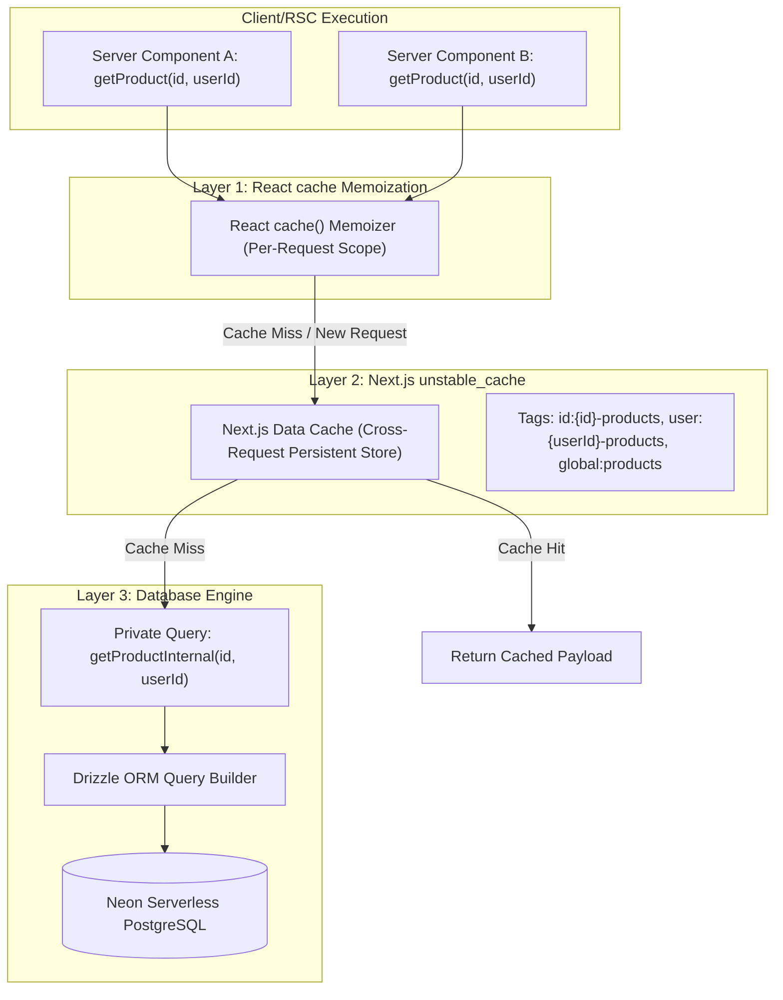

# Chapter 03: DB Caching & Drizzle Query Patterns

[Master FSD Index](../FEATURE-SLICED-DESIGN.md) > Chapter 03: DB Caching & Drizzle Patterns

---

## 1. Overview & Architectural Motivation

Database access in this application balances low-latency read performance with strong multi-tenant isolation and granular cache invalidation. To achieve this, the architecture combines:

1. **Neon Serverless PostgreSQL** via HTTP driver (`drizzle-orm/neon-http`).
2. **Dual-Layer Caching Engine**: Combining React `cache()` for per-request deduplication with Next.js `unstable_cache()` for persistent, cross-request caching.
3. **Deterministic Tag Taxonomy**: Hierarchical scoping at global, user, and entity ID levels.
4. **Public Cached Wrapper vs Private Internal Query Pattern**: Complete decoupling of cache orchestration from raw Drizzle query definitions.
5. **Atomic Multi-Table Batching**: Executing transactional relational updates with `db.batch()`.



---

## 2. Dual-Layer Caching Architecture

### 2.1 The Need for Two Caching Layers

Next.js applications suffer from two distinct types of redundant database queries:
- **Intra-Request Redundancy**: Multiple server components in the same render tree querying the same entity (e.g., layout, header banner, and page component all querying the current product or subscription tier).
- **Inter-Request Redundancy**: Multiple HTTP requests from different sessions fetching read-heavy, low-churn data (e.g., country discount tiers, product customization).

### 2.2 Unified `dbCache` Implementation

The helper utility [`src/lib/cache.ts`](file:///c:/projects/parity-deals-clone/src/lib/cache.ts) unifies React's `cache()` and Next.js `unstable_cache()` into a single declarative wrapper:

```typescript
import { revalidateTag, unstable_cache } from "next/cache"
import { cache } from "react"
import { formatCompactNumber } from "./formatters"

formatCompactNumber(2090)

export type ValidTags =
  | ReturnType<typeof getGlobalTag>
  | ReturnType<typeof getUserTag>
  | ReturnType<typeof getIdTag>

export const CACHE_TAGS = {
  products: "products",
  productViews: "productViews",
  subscription: "subscription",
  countries: "countries",
  countryGroups: "countryGroups",
} as const

export function getGlobalTag(tag: keyof typeof CACHE_TAGS) {
  return `global:${CACHE_TAGS[tag]}` as const
}

export function getUserTag(userId: string, tag: keyof typeof CACHE_TAGS) {
  return `user:${userId}-${CACHE_TAGS[tag]}` as const
}

export function getIdTag(id: string, tag: keyof typeof CACHE_TAGS) {
  return `id:${id}-${CACHE_TAGS[tag]}` as const
}

export function clearFullCache() {
  revalidateTag("*")
}

// eslint-disable-next-line @typescript-eslint/no-explicit-any
export function dbCache<T extends (...args: any[]) => Promise<any>>(
  cb: Parameters<typeof unstable_cache<T>>[0],
  { tags }: { tags: ValidTags[] }
) {
  return cache(unstable_cache<T>(cb, undefined, { tags: [...tags, "*"] }))
}

export function revalidateDbCache({
  tag,
  userId,
  id,
}: {
  tag: keyof typeof CACHE_TAGS
  userId?: string
  id?: string
}) {
  revalidateTag(getGlobalTag(tag))
  if (userId != null) {
    revalidateTag(getUserTag(userId, tag))
  }
  if (id != null) {
    revalidateTag(getIdTag(id, tag))
  }
}
```

---

## 3. Deterministic Tag Taxonomy

Cache keys are structured using strict, strongly-typed naming conventions to eliminate cache collisions and ensure surgical invalidation:

| Scope | Helper Function | Format | Example | Invalidation Scope |
| :--- | :--- | :--- | :--- | :--- |
| **Global** | `getGlobalTag(tag)` | `global:${tag}` | `global:products` | All cached entries across all users for that domain table |
| **User-Scoped** | `getUserTag(userId, tag)` | `user:${userId}-${tag}` | `user:user_2t...-products` | Only queries belonging to that specific user |
| **Entity-Scoped** | `getIdTag(id, tag)` | `id:${id}-${tag}` | `id:8f9e...-products` | Only queries referencing that specific record ID |

When `revalidateDbCache({ tag: "products", userId, id })` is called after a mutation:
1. It invalidates `global:products`
2. It invalidates `user:${userId}-products` (if `userId` provided)
3. It invalidates `id:${id}-products` (if `id` provided)

---

## 4. The Public Cached Wrapper vs Private Internal Query Pattern

To prevent developers from accidentally running raw uncached queries or writing inconsistent caching tags, all database operations in `server/db/*.ts` follow the **Public Cached Wrapper / Private Internal Query Pattern**:

1. **Public Export**: A typed wrapper function that invokes `dbCache(internalFn, { tags: [...] })`.
2. **Private Internal Function**: An unexported raw Drizzle ORM query (`internalFn`) that executes the actual SQL logic against `db.query.*` or `db.select()`.

### 4.1 Reference Implementation: `src/features/products/server/db/products.ts`

Verbatim snippet from [`src/features/products/server/db/products.ts`](file:///c:/projects/parity-deals-clone/src/features/products/server/db/products.ts#L19-L50):

```typescript
export function getProductCountryGroups({
  productId,
  userId,
}: {
  productId: string
  userId: string
}) {
  const cacheFn = dbCache(getProductCountryGroupsInternal, {
    tags: [
      getIdTag(productId, CACHE_TAGS.products),
      getGlobalTag(CACHE_TAGS.countries),
      getGlobalTag(CACHE_TAGS.countryGroups),
    ],
  })

  return cacheFn({ productId, userId })
}

export function getProductCustomization({
  productId,
  userId,
}: {
  productId: string
  userId: string
}) {
  const cacheFn = dbCache(getProductCustomizationInternal, {
    tags: [getIdTag(productId, CACHE_TAGS.products)],
  })

  return cacheFn({ productId, userId })
}
```

### 4.2 Comparison: Public vs Internal

```typescript
// 1. Public Cached Wrapper (Exported)
export function getProduct({ id, userId }: { id: string; userId: string }) {
  const cacheFn = dbCache(getProductInternal, {
    tags: [getIdTag(id, CACHE_TAGS.products)],
  })

  return cacheFn({ id, userId })
}

// 2. Private Query Implementation (Unexported)
function getProductInternal({ id, userId }: { id: string; userId: string }) {
  return db.query.ProductTable.findFirst({
    where: ({ clerkUserId, id: idCol }, { eq, and }) =>
      and(eq(clerkUserId, userId), eq(idCol, id)),
  })
}
```

---

## 5. Drizzle ORM Batching & Multi-Table Relational Transactions

When updating complex relational state (such as deleting existing country group discount rules and upserting new discount overrides), running sequential HTTP roundtrips over serverless connections introduces significant latency and race hazards.

Instead, the codebase utilizes `db.batch()` from `drizzle-orm` to execute heterogeneous SQL statements in a single HTTP request roundtrip.

### 5.1 Reference Implementation: `updateCountryDiscounts`

From [`src/features/products/server/db/products.ts`](file:///c:/projects/parity-deals-clone/src/features/products/server/db/products.ts#L172-L226):

```typescript
export async function updateCountryDiscounts(
  deleteGroup: { countryGroupId: string }[],
  insertGroup: (typeof CountryGroupDiscountTable.$inferInsert)[],
  { productId, userId }: { productId: string; userId: string }
) {
  const product = await getProduct({ id: productId, userId })
  if (product == null) return false

  const statements: BatchItem<"pg">[] = []
  if (deleteGroup.length > 0) {
    statements.push(
      db.delete(CountryGroupDiscountTable).where(
        and(
          eq(CountryGroupDiscountTable.productId, productId),
          inArray(
            CountryGroupDiscountTable.countryGroupId,
            deleteGroup.map(group => group.countryGroupId)
          )
        )
      )
    )
  }

  if (insertGroup.length > 0) {
    statements.push(
      db
        .insert(CountryGroupDiscountTable)
        .values(insertGroup)
        .onConflictDoUpdate({
          target: [
            CountryGroupDiscountTable.productId,
            CountryGroupDiscountTable.countryGroupId,
          ],
          set: {
            coupon: sql.raw(
              `excluded.${CountryGroupDiscountTable.coupon.name}`
            ),
            discountPercentage: sql.raw(
              `excluded.${CountryGroupDiscountTable.discountPercentage.name}`
            ),
          },
        })
    )
  }

  if (statements.length > 0) {
    await db.batch(statements as [BatchItem<"pg">])
  }

  revalidateDbCache({
    tag: CACHE_TAGS.products,
    userId,
    id: productId,
  })
}
```

### 5.2 Key Benefits of `db.batch()`:
1. **Single Network Trip**: Batches delete and upsert statements into one HTTP POST to Neon.
2. **Atomic Execution**: Prevents partial states where discounts are deleted but new ones fail to insert.
3. **Automatic Revalidation**: One consolidated `revalidateDbCache()` call purges all related cached keys immediately following successful batch execution.

---

← Previous: [Chapter 02: Server Layer & RSC Actions](./02-server-layer-and-rsc-actions.md) | Next: [Chapter 04: Forms, Zod & UI Patterns](./04-forms-zod-and-ui-patterns.md) →
