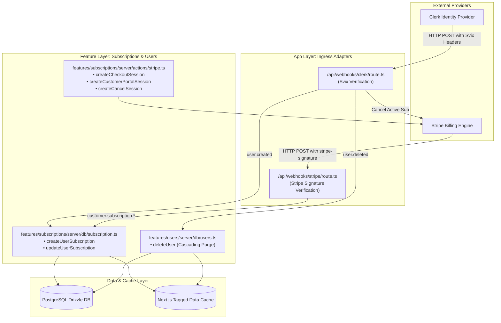

[Master FSD Index](../FEATURE-SLICED-DESIGN.md) > Chapter 06: Webhooks & Third-Party Sync

# Chapter 06: Webhooks & Third-Party Synchronization

## 1. Overview & Architecture Boundary

In the Parity Deals application, external third-party services—specifically **Clerk** (Authentication and Identity) and **Stripe** (Billing, Subscriptions, and Customer Portal)—drive asynchronous state changes that must be synchronized with the local PostgreSQL database managed by Drizzle ORM.

Under Feature-Sliced Design (FSD), incoming webhook endpoints reside at the **App layer** (`src/app/api/webhooks/*`) because they serve as external entry points (transport adapters). They delegate domain business logic directly to the server database and action layers within individual features (`src/features/subscriptions/server/*` and `src/features/users/server/*`).



---

## 2. Clerk Webhook Security & Lifecycle Synchronization

The Clerk webhook handler is responsible for keeping user identity and default subscription tiers strictly synchronized with the application database.

### 2.1 Cryptographic Header Verification with Svix

Clerk secures outgoing webhooks using [Svix](https://www.svix.com/). Every incoming request contains three cryptographic headers:
1. `svix-id`: Unique identifier for the webhook message.
2. `svix-timestamp`: UNIX timestamp of when the webhook was dispatched.
3. `svix-signature`: HMAC-SHA256 signature generated using the shared secret.

The verification process:
- Reads `svix-id`, `svix-timestamp`, and `svix-signature` from [`headers()`](file:///c:/projects/parity-deals-clone/src/app/api/webhooks/clerk/route.ts#L15-L18).
- Fails fast with HTTP `400` if any header is absent.
- Serializes the parsed JSON payload back to a raw string representation.
- Instantiates a `Webhook` instance using `env.CLERK_WEBHOOK_SECRET` and executes `wh.verify(body, headers)`.

### 2.2 Lifecycle Event Dispatching

#### `user.created`
When a new user registers through Clerk:
- Automatically creates a new subscription entry with the `Free` tier in [`UserSubscriptionTable`](file:///c:/projects/parity-deals-clone/src/drizzle/schema.ts).
- Uses PostgreSQL `ON CONFLICT (clerk_user_id) DO NOTHING` in [`createUserSubscription`](file:///c:/projects/parity-deals-clone/src/features/subscriptions/server/db/subscription.ts#L7-L30) to guarantee idempotent execution.
- Invalidates the user's subscription cache tag (`getUserTag(userId, CACHE_TAGS.subscription)`).

#### `user.deleted`
When a user deletes their account:
- Checks if the user has an active Stripe subscription (`stripeSubscriptionId`).
- If present, invokes the Stripe API to cancel the subscription: `stripe.subscriptions.cancel(userSubscription.stripeSubscriptionId)`.
- Invokes [`deleteUser(event.data.id)`](file:///c:/projects/parity-deals-clone/src/features/users/server/db/users.ts#L6-L39) to atomically delete user subscriptions and products in a Drizzle batch transaction (`db.batch`), purging cached data across all deleted entity tags.

### 2.3 Verbatim Source: Clerk Webhook Route

The exact implementation from [`src/app/api/webhooks/clerk/route.ts`](file:///c:/projects/parity-deals-clone/src/app/api/webhooks/clerk/route.ts#L1-L68):

```typescript
import { Webhook } from "svix"
import { headers } from "next/headers"
import { WebhookEvent } from "@clerk/nextjs/server"
import { env } from "@/data/env/server"
import {
  createUserSubscription,
  getUserSubscription,
} from "@/features/subscriptions/server/db/subscription"
import { deleteUser } from "@/features/users/server/db/users"
import { Stripe } from "stripe"

const stripe = new Stripe(env.STRIPE_SECRET_KEY)

export async function POST(req: Request) {
  const headerPayload = headers()
  const svixId = headerPayload.get("svix-id")
  const svixTimestamp = headerPayload.get("svix-timestamp")
  const svixSignature = headerPayload.get("svix-signature")

  if (!svixId || !svixTimestamp || !svixSignature) {
    return new Response("Error occurred -- no svix headers", {
      status: 400,
    })
  }

  const payload = await req.json()
  const body = JSON.stringify(payload)

  const wh = new Webhook(env.CLERK_WEBHOOK_SECRET)
  let event: WebhookEvent

  try {
    event = wh.verify(body, {
      "svix-id": svixId,
      "svix-timestamp": svixTimestamp,
      "svix-signature": svixSignature,
    }) as WebhookEvent
  } catch (err) {
    console.error("Error verifying webhook:", err)
    return new Response("Error occurred", {
      status: 400,
    })
  }

  switch (event.type) {
    case "user.created": {
      await createUserSubscription({
        clerkUserId: event.data.id,
        tier: "Free",
      })
      break
    }
    case "user.deleted": {
      if (event.data.id != null) {
        const userSubscription = await getUserSubscription(event.data.id)
        if (userSubscription?.stripeSubscriptionId != null) {
          await stripe.subscriptions.cancel(
            userSubscription?.stripeSubscriptionId
          )
        }
        await deleteUser(event.data.id)
      }
    }
  }

  return new Response("", { status: 200 })
}
```

---

## 3. Stripe Subscription Management & Webhooks

Subscription billing combines **Server Actions** (for client-initiated billing redirects) and **Webhook Routes** (for asynchronous payment reconciliation).

### 3.1 Stripe Server Actions

Stripe operations live inside [`src/features/subscriptions/server/actions/stripe.ts`](file:///c:/projects/parity-deals-clone/src/features/subscriptions/server/actions/stripe.ts).

1. **`createCheckoutSession(tier: PaidTierNames)`**:
   - If the user has no existing `stripeCustomerId`, initializes a new Stripe Checkout Session (`stripe.checkout.sessions.create`) with `metadata.clerkUserId`, `mode: "subscription"`, and corresponding `stripePriceId`.
   - If the user already has a `stripeCustomerId`, routes them to an upgrade confirmation session in the Stripe Billing Customer Portal with `flow_data.type = "subscription_update_confirm"`.
2. **`createCustomerPortalSession()`**:
   - Generates a Stripe Customer Portal session URL (`stripe.billingPortal.sessions.create`) allowing users to manage payment methods, invoices, and billing details directly.
3. **`createCancelSession()`**:
   - Opens the Stripe Customer Portal targeted directly at the cancellation flow (`flow_data.type = "subscription_cancel"`).

### 3.2 Verbatim Source: Stripe Server Action Snippet

The exact implementation from [`src/features/subscriptions/server/actions/stripe.ts`](file:///c:/projects/parity-deals-clone/src/features/subscriptions/server/actions/stripe.ts#L1-L40):

```typescript
"use server"

import { PaidTierNames, subscriptionTiers } from "@/data/subscriptionTiers"
import { auth, currentUser, User } from "@clerk/nextjs/server"
import { getUserSubscription } from "@/features/subscriptions/server/db/subscription"
import { Stripe } from "stripe"
import { env as serverEnv } from "@/data/env/server"
import { env as clientEnv } from "@/data/env/client"
import { redirect } from "next/navigation"

const stripe = new Stripe(serverEnv.STRIPE_SECRET_KEY)

export async function createCancelSession() {
  const user = await currentUser()
  if (user == null) return { error: true }

  const subscription = await getUserSubscription(user.id)

  if (subscription == null) return { error: true }

  if (
    subscription.stripeCustomerId == null ||
    subscription.stripeSubscriptionId == null
  ) {
    return new Response(null, { status: 500 })
  }

  const portalSession = await stripe.billingPortal.sessions.create({
    customer: subscription.stripeCustomerId,
    return_url: `${clientEnv.NEXT_PUBLIC_SERVER_URL}/dashboard/subscription`,
    flow_data: {
      type: "subscription_cancel",
      subscription_cancel: {
        subscription: subscription.stripeSubscriptionId,
      },
    },
  })

  redirect(portalSession.url)
}
```

### 3.3 Stripe Webhook Processing

The Stripe webhook route [`src/app/api/webhooks/stripe/route.ts`](file:///c:/projects/parity-deals-clone/src/app/api/webhooks/stripe/route.ts) constructs events via `stripe.webhooks.constructEvent(rawBody, signature, secret)`.

| Event Type | Trigger Condition | Handler Action |
| :--- | :--- | :--- |
| `customer.subscription.created` | Customer successfully completes a new subscription checkout | Extracts `clerkUserId` from `subscription.metadata`. Updates DB record with `stripeCustomerId`, `stripeSubscriptionId`, `stripeSubscriptionItemId`, and resolved `tier.name`. |
| `customer.subscription.updated` | Customer upgrades, downgrades, or modifies plan via Customer Portal | Looks up record by `stripeCustomerId`. Updates `tier.name` based on the new price ID. |
| `customer.subscription.deleted` | Subscription cancelled or payment lapsed | Reverts user tier to `Free` and resets `stripeSubscriptionId` and `stripeSubscriptionItemId` to `null`. |

---

## 4. Resilience, Idempotency & Invalidation Matrix

| Source | Event / Action | Ingress Target | Idempotency & Safety Mechanism | Revalidation Tag(s) |
| :--- | :--- | :--- | :--- | :--- |
| **Clerk** | `user.created` | `/api/webhooks/clerk` | `ON CONFLICT (clerk_user_id) DO NOTHING` | `user:{clerkUserId}:subscription` |
| **Clerk** | `user.deleted` | `/api/webhooks/clerk` | Null check + Drizzle `db.batch([delete, delete])` | `user:{clerkUserId}:subscription`, `user:{clerkUserId}:products` |
| **Stripe** | `customer.subscription.created` | `/api/webhooks/stripe` | Indexed update on `clerkUserId` | `user:{clerkUserId}:subscription` |
| **Stripe** | `customer.subscription.updated` | `/api/webhooks/stripe` | Indexed update on `stripeCustomerId` | `user:{clerkUserId}:subscription` |
| **Stripe** | `customer.subscription.deleted` | `/api/webhooks/stripe` | Indexed downgrade to Free tier | `user:{clerkUserId}:subscription` |

---

← Previous: [Chapter 05: ESLint Boundaries & Governance](./05-eslint-boundaries-and-governance.md) | Next: [Chapter 07: Analytics & Aggregations](./07-analytics-and-aggregations.md) →
