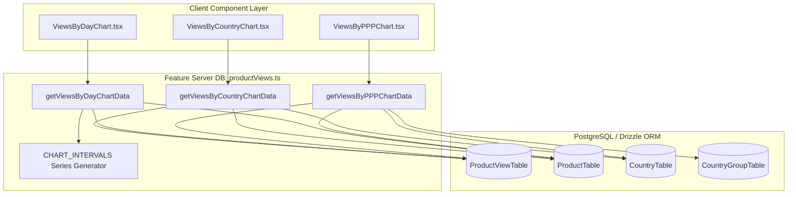

[Master FSD Index](../FEATURE-SLICED-DESIGN.md) > Chapter 07: Analytics & Aggregations

# Chapter 07: Analytics & SQL Aggregations

## 1. Overview & Architecture Boundary

The analytics subsystem provides multi-dimensional visualization of visitor telemetry across products, countries, purchasing-power-parity (PPP) discount groups, and date intervals.

Under Feature-Sliced Design (FSD):
- **Server DB Layer** (`src/features/analytics/server/db/productViews.ts`): Houses high-performance aggregation queries, Common Table Expressions (CTEs), dynamic calendar date generators, and Next.js tag-based data caching.
- **Client Component Layer** (`src/features/analytics/components/charts/*`): Encapsulates visualization components powered by `recharts` and `shadcn/ui` Chart primitives (`ChartContainer`, `ChartTooltip`, `ChartTooltipContent`).



---

## 2. Timezone-Aware SQL Aggregations

Analytics metrics depend strictly on user-selected timezones and rolling time intervals. Without explicit timezone translation in both Node.js runtime and PostgreSQL, date buckets drift across UTC midnight boundaries.

### 2.1 Timezone Normalization with `@date-fns/tz` and PostgreSQL `AT TIME ZONE`

1. **Application Layer Alignment**: Uses `@date-fns/tz` to compute the exact start of the interval in the user's localized timezone:
   ```typescript
   const startDate = startOfDay(interval.startDate, { in: tz(timezone) })
   ```
2. **Database Engine Shift**: Converts UTC timestamp columns on-the-fly to the requested timezone before evaluating boundary conditions:
   ```sql
   sql`${ProductViewTable.visitedAt} AT TIME ZONE ${timezone}`.inlineParams() >= startDate
   ```

### 2.2 Date Interval Filtering (`CHART_INTERVALS`)

Intervals define dynamic calendar generators (`GENERATE_SERIES`), grouping expressions, and display formatters:

- **`last7Days`**: Generates a 7-day continuous series (`current_date - 7` to `current_date`, `'1 day'::interval`), grouped with `DATE(col)`.
- **`last30Days`**: Generates a 30-day continuous series (`current_date - 30` to `current_date`, `'1 day'::interval`), grouped with `DATE(col)`.
- **`last365Days`**: Generates a 12-month series (`DATE_TRUNC('month', current_date - 365)` to `DATE_TRUNC('month', current_date)`, `'1 month'::interval`), grouped with `DATE_TRUNC('month', col)`.

### 2.3 Subquery and CTE Zero-Filling Architecture

When querying timeseries data, days or months with zero views must not be omitted from the output. Rather than maintaining static database date-dimension tables or post-processing sparse arrays in JavaScript, the query engine constructs dynamic SQL CTEs:

1. **Product Ownership CTE (`productsSq`)**: Restricts queries to the authenticated user's products.
2. **Product Views CTE (`productViewSq`)**: Pre-filters and timezone-shifts visitor events.
3. **Date Series Left Join**: Left-joins the continuous `GENERATE_SERIES` table to `productViewSq`, yielding count `0` for days without activity.

### 2.4 Verbatim Source: Cached Aggregation Query Facades

The exact implementation from [`src/features/analytics/server/db/productViews.ts`](file:///c:/projects/parity-deals-clone/src/features/analytics/server/db/productViews.ts#L28-L110):

```typescript
export function getViewsByCountryChartData({
  timezone,
  productId,
  userId,
  interval,
}: {
  timezone: string
  productId?: string
  userId: string
  interval: (typeof CHART_INTERVALS)[keyof typeof CHART_INTERVALS]
}) {
  const cacheFn = dbCache(getViewsByCountryChartDataInternal, {
    tags: [
      getUserTag(userId, CACHE_TAGS.productViews),
      productId == null
        ? getUserTag(userId, CACHE_TAGS.products)
        : getIdTag(productId, CACHE_TAGS.products),
      getGlobalTag(CACHE_TAGS.countries),
    ],
  })

  return cacheFn({
    timezone,
    productId,
    userId,
    interval,
  })
}

export function getViewsByPPPChartData({
  timezone,
  productId,
  userId,
  interval,
}: {
  timezone: string
  productId?: string
  userId: string
  interval: (typeof CHART_INTERVALS)[keyof typeof CHART_INTERVALS]
}) {
  const cacheFn = dbCache(getViewsByPPPChartDataInternal, {
    tags: [
      getUserTag(userId, CACHE_TAGS.productViews),
      productId == null
        ? getUserTag(userId, CACHE_TAGS.products)
        : getIdTag(productId, CACHE_TAGS.products),
      getGlobalTag(CACHE_TAGS.countries),
      getGlobalTag(CACHE_TAGS.countryGroups),
    ],
  })

  return cacheFn({
    timezone,
    productId,
    userId,
    interval,
  })
}

export function getViewsByDayChartData({
  timezone,
  productId,
  userId,
  interval,
}: {
  timezone: string
  productId?: string
  userId: string
  interval: (typeof CHART_INTERVALS)[keyof typeof CHART_INTERVALS]
}) {
  const cacheFn = dbCache(getViewsByDayChartDataInternal, {
    tags: [
      getUserTag(userId, CACHE_TAGS.productViews),
      productId == null
        ? getUserTag(userId, CACHE_TAGS.products)
        : getIdTag(productId, CACHE_TAGS.products),
    ],
  })

  return cacheFn({
    timezone,
    productId,
    userId,
    interval,
  })
}
```

---

## 3. Charting Transformation Pipelines

### 3.1 Views by Country Pipeline

**Implementation**: [`getViewsByCountryChartDataInternal`](file:///c:/projects/parity-deals-clone/src/features/analytics/server/db/productViews.ts#L153-L186)
- **Join Strategy**: Joins `ProductViewTable` with `productsSq` CTE and `CountryTable`.
- **Grouping**: Groups by `[CountryTable.code, CountryTable.name]`.
- **Ordering & Limits**: Sorts by `desc(views)` and caps results to the top 25 countries.

### 3.2 Views by Day Pipeline

**Implementation**: [`getViewsByDayChartDataInternal`](file:///c:/projects/parity-deals-clone/src/features/analytics/server/db/productViews.ts#L230-L269)
- **Join Strategy**: `interval.sql` (`GENERATE_SERIES`) left-joined with `productViewSq` on matching date keys.
- **Formatter Mapping**: Maps formatted string dates using `Intl.DateTimeFormat` configured with short dates or month names.

### 3.3 Views by PPP Group Pipeline

**Implementation**: [`getViewsByPPPChartDataInternal`](file:///c:/projects/parity-deals-clone/src/features/analytics/server/db/productViews.ts#L187-L229)
- **Join Strategy**: `CountryGroupTable` left-joined with filtered `productViewSq` by `countryGroupId`.
- **Ordering**: Sorted alphabetically by PPP group name to present parity tier distribution consistently.

### 3.4 Integration with shadcn/ui Chart & Recharts

Client charts utilize unified presentation components:
- [`ViewsByCountryChart.tsx`](file:///c:/projects/parity-deals-clone/src/features/analytics/components/charts/ViewsByCountryChart.tsx): Renders an accessible `BarChart` with ISO country codes on the X-axis and formatted visitor counts on the Y-axis.
- [`ViewsByDayChart.tsx`](file:///c:/projects/parity-deals-clone/src/features/analytics/components/charts/ViewsByDayChart.tsx): Renders a time-series `BarChart` across consecutive date intervals.
- [`ViewsByPPPChart.tsx`](file:///c:/projects/parity-deals-clone/src/features/analytics/components/charts/ViewsByPPPChart.tsx): Sanitizes `"Parity Group: "` prefixes and plots visitor distribution across parity discount tiers.

```tsx
<ChartContainer config={chartConfig} className="min-h-[150px] max-h-[250px] w-full">
  <BarChart accessibilityLayer data={chartData}>
    <XAxis dataKey="countryCode" tickLine={false} tickMargin={10} />
    <YAxis
      tickLine={false}
      tickMargin={10}
      allowDecimals={false}
      tickFormatter={formatCompactNumber}
    />
    <ChartTooltip content={<ChartTooltipContent />} />
    <Bar dataKey="views" fill="var(--color-views)" />
  </BarChart>
</ChartContainer>
```

---

## 4. Cache Tags & Invalidation Protocol

All analytic reads are wrapped in [`dbCache`](file:///c:/projects/parity-deals-clone/src/lib/cache.ts) and keyed with granular cache tags:

| Function | Associated Cache Tags | Invalidation Trigger |
| :--- | :--- | :--- |
| `getViewsByCountryChartData` | `user:{userId}:productViews`, `user:{userId}:products` or `product:{productId}:products`, `global:countries` | `createProductView`, `createProduct`, `deleteProduct` |
| `getViewsByPPPChartData` | `user:{userId}:productViews`, `user:{userId}:products` or `product:{productId}:products`, `global:countries`, `global:countryGroups` | `createProductView`, `createProduct`, `deleteProduct` |
| `getViewsByDayChartData` | `user:{userId}:productViews`, `user:{userId}:products` or `product:{productId}:products` | `createProductView`, `createProduct`, `deleteProduct` |
| `getProductViewCount` | `user:{userId}:productViews` | `createProductView` |

---

← Previous: [Chapter 06: Webhooks & Third-Party Sync](./06-webhooks-and-third-party-sync.md) | Next: [Chapter 08: Migration & Refactor Runbook](./08-migration-and-refactor-runbook.md) →
