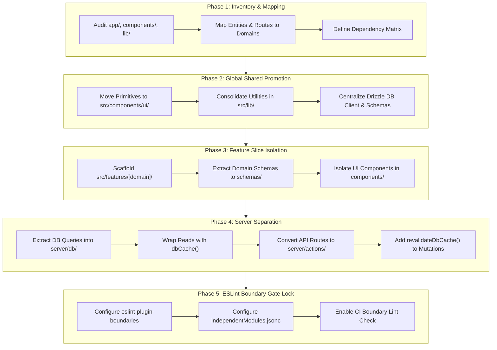

[Master FSD Index](../FEATURE-SLICED-DESIGN.md) > Chapter 08: Migration & Refactor Runbook

# Chapter 08: Migration & Refactor Runbook

This runbook establishes the canonical, step-by-step engineering protocol for refactoring legacy Next.js applications into a strict **Feature-Sliced Design (FSD)** architecture. It outlines the systematic 5-phase extraction lifecycle, provides concrete before-and-after code transformations from real production surfaces (such as the Products domain), and documents architectural pitfalls—including `"use server"` barrel leakage, premature shared promotion, and cache invalidation omissions.

---

## 1. The 5-Phase Refactoring Protocol

Migrating a legacy monolithic Next.js application into Feature-Sliced Design without incurring downtime or regressions requires an incremental, bottom-up decomposition process.



---

### Phase 1: Inventory & Domain Mapping

Before moving a single line of code, execute a structural audit across existing directories (`app/`, `pages/`, `components/`, `lib/`, `api/`, `drizzle/`):

1. **Entity Identification**: Catalog core business models (`products`, `subscriptions`, `productViews`, `countries`, `countryGroups`, `users`).
2. **Route-to-Domain Mapping**: Identify which routes serve single domains versus orchestration pages:
   - `src/app/dashboard/products/*` $\rightarrow$ `products` domain.
   - `src/app/dashboard/subscription/*` $\rightarrow$ `subscriptions` domain.
   - `src/app/dashboard/analytics/*` $\rightarrow$ `analytics` domain.
   - `src/app/api/webhooks/clerk/*` $\rightarrow$ `users` domain.
   - `src/app/api/webhooks/stripe/*` $\rightarrow$ `subscriptions` domain.
3. **Cross-Dependency Inventory**: Identify shared libraries and cross-cutting concerns (e.g., authentication via `@clerk/nextjs`, caching layer via `next/cache`, database access via Drizzle ORM).

---

### Phase 2: Global Shared Promotion

Promote all domain-agnostic primitives to the shared foundational layer. Items in `src/components/`, `src/lib/`, and `src/drizzle/` must contain zero imports from `src/features/` or `src/app/`.

```
src/
├── components/
│   ├── ui/                    # shadcn / Radix primitives (button, dialog, input, etc.)
│   ├── Banner.tsx             # Shared widget display components
│   ├── BrandLogo.tsx          # Shared brand assets
│   └── RequiredLabelIcon.tsx  # Shared form indicators
├── lib/
│   ├── cache.ts               # Global caching tags & dbCache helpers
│   ├── formatters.ts          # Pure number/currency/date formatters
│   ├── permissions.ts         # User tier authorization rules
│   └── utils.ts               # Tailwind merge & styling utilities
└── drizzle/
    ├── db.ts                  # Neon / node-postgres connection pool
    └── schema.ts              # PostgreSQL schema definitions & relations
```

> [!IMPORTANT]
> The shared layer is strictly foundational. If a component, utility, or schema references a specific business workflow or domain-specific entity structure, it **must not** be promoted to `src/components/` or `src/lib/`.

---

### Phase 3: Feature Slice Isolation

Scaffold the target domain within `src/features/[domain]/` adhering to standard FSD colocation:

```
src/features/products/
├── components/
│   ├── forms/
│   │   ├── CountryDiscountsForm.tsx
│   │   ├── ProductCustomizationForm.tsx
│   │   └── ProductDeailsForm.tsx
│   ├── AddToSiteProductModalContent.tsx
│   ├── DeleteProductAlertDialogContent.tsx
│   ├── NoProducts.tsx
│   └── ProductGrid.tsx
├── schemas/
│   └── products.ts            # Zod validation schemas for inputs and mutations
└── server/
    ├── actions/
    │   └── products.ts        # Next.js Server Actions ("use server")
    └── db/
        └── products.ts        # Cached queries & raw Drizzle database operations
```

#### Colocation Rules:
- **Schemas (`schemas/`)**: Houses Zod schemas defining form payloads, action inputs, and API contracts (e.g., `productDetailsSchema`, `productCustomizationSchema`).
- **Components (`components/`)**: Houses domain UI components. Client components (`"use client"`) and Server components are segregated cleanly.
- **Server (`server/`)**: Subdivided strictly into `actions/` (mutations, orchestration, redirect triggers) and `db/` (cached queries and raw persistence).

---

### Phase 4: Server Separation (Data & Actions)

Decompose legacy API route handlers and monolithic page data fetching into two isolated sublayers:

#### 1. Cached Database Layer (`src/features/[domain]/server/db/`)
- Encapsulates Drizzle ORM queries.
- Wraps all data reads in `dbCache` with precise tag dependencies (`getGlobalTag`, `getUserTag`, `getIdTag`).
- Exports mutation helpers that execute SQL statements and invoke `revalidateDbCache`.

```typescript
// src/features/products/server/db/products.ts
import { db } from "@/drizzle/db"
import { ProductTable } from "@/drizzle/schema"
import { CACHE_TAGS, dbCache, getUserTag, getIdTag, revalidateDbCache } from "@/lib/cache"
import { eq, and, desc } from "drizzle-orm"

// 1. Cached Read Function
export function getProducts(userId: string, { limit }: { limit?: number } = {}) {
  const cacheFn = dbCache(getProductsInternal, {
    tags: [getUserTag(userId, CACHE_TAGS.products)],
  })
  return cacheFn(userId, { limit })
}

async function getProductsInternal(userId: string, { limit }: { limit?: number }) {
  return db.query.ProductTable.findMany({
    where: ({ clerkUserId }, { eq }) => eq(clerkUserId, userId),
    orderBy: ({ createdAt }, { desc }) => desc(createdAt),
    limit,
  })
}

// 2. Mutation with Automated Cache Revalidation
export async function deleteProduct({ id, userId }: { id: string; userId: string }) {
  const { rowCount } = await db
    .delete(ProductTable)
    .where(and(eq(ProductTable.id, id), eq(ProductTable.clerkUserId, userId)))

  if (rowCount > 0) {
    revalidateDbCache({
      tag: CACHE_TAGS.products,
      userId,
      id,
    })
  }

  return rowCount > 0
}
```

#### 2. Server Action Layer (`src/features/[domain]/server/actions/`)
- Declares `"use server"` at the top of the file.
- Authenticates caller using Clerk (`auth()`).
- Validates unsafe user input using Zod schemas (`safeParse`).
- Enforces permission checks (`canCreateProduct(userId)`).
- Calls underlying `server/db/` functions.
- Manages routing side-effects (`redirect()`) or returns structured feedback `{ error: boolean; message: string }`.

```typescript
// src/features/products/server/actions/products.ts
"use server"

import { auth } from "@clerk/nextjs/server"
import { z } from "zod"
import { redirect } from "next/navigation"
import { productDetailsSchema } from "@/features/products/schemas/products"
import { createProduct as createProductDb } from "@/features/products/server/db/products"
import { canCreateProduct } from "@/lib/permissions"

export async function createProduct(
  unsafeData: z.infer<typeof productDetailsSchema>
): Promise<{ error: boolean; message: string } | undefined> {
  const { userId } = auth()
  const { success, data } = productDetailsSchema.safeParse(unsafeData)
  const canCreate = await canCreateProduct(userId)

  if (!success || userId == null || !canCreate) {
    return { error: true, message: "There was an error creating your product" }
  }

  const { id } = await createProductDb({ ...data, clerkUserId: userId })

  redirect(`/dashboard/products/${id}/edit?tab=countries`)
}
```

---

### Phase 5: ESLint Boundary Gate Lock

Lock in architectural boundaries using `eslint-plugin-boundaries` in `.eslintrc.json` and `independentModules.jsonc`. This ensures cross-feature imports and upward leakage fail in CI before merging.

#### `.eslintrc.json` Configuration:

```json
{
  "extends": ["next/core-web-vitals", "next/typescript"],
  "plugins": ["boundaries"],
  "settings": {
    "boundaries/include": ["src/**/*"],
    "boundaries/elements": [
      {
        "mode": "full",
        "type": "shared",
        "pattern": [
          "src/components/**/*",
          "src/data/**/*",
          "src/drizzle/**/*",
          "src/hooks/**/*",
          "src/lib/**/*",
          "src/server/**/*"
        ]
      },
      {
        "mode": "full",
        "type": "feature",
        "capture": ["featureName"],
        "pattern": ["src/features/*/**/*"]
      },
      {
        "mode": "full",
        "type": "app",
        "capture": ["_", "fileName"],
        "pattern": ["src/app/**/*"]
      },
      {
        "mode": "full",
        "type": "neverImport",
        "pattern": ["src/*", "src/tasks/**/*"]
      }
    ]
  },
  "rules": {
    "boundaries/no-unknown": ["error"],
    "boundaries/no-unknown-files": ["error"],
    "boundaries/element-types": [
      "error",
      {
        "default": "disallow",
        "rules": [
          {
            "from": ["shared"],
            "allow": ["shared"]
          },
          {
            "from": ["feature"],
            "allow": [
              "shared",
              ["feature", { "featureName": "${from.featureName}" }]
            ]
          },
          {
            "from": ["app", "neverImport"],
            "allow": ["shared", "feature"]
          },
          {
            "from": ["app"],
            "allow": [["app", { "fileName": "*.css" }]]
          }
        ]
      }
    ]
  }
}
```

#### Boundary Verification Rules:
- **`shared`** can only import other **`shared`** modules.
- **`feature`** can import from **`shared`** and its own **`featureName`** family only (no cross-feature imports).
- **`app`** acts as the composition layer and can import from both **`shared`** and **`feature`**.

---

## 2. Concrete Before / After Code Transformations

### The "Before" Monolith: Legacy Page File

In legacy implementations, pages often become bloated monoliths combining database queries, form handling, client state, Zod validation, mutation logic, and styling in a single file.

```tsx
// ❌ BEFORE: src/app/dashboard/products/page.tsx (Monolithic Anti-Pattern)
"use client"

import { useState, useEffect } from "react"
import { db } from "@/drizzle/db"
import { ProductTable } from "@/drizzle/schema"
import { eq } from "drizzle-orm"
import { z } from "zod"
import { useForm } from "react-hook-form"
import { zodResolver } from "@hookform/resolvers/zod"

const productSchema = z.object({
  name: z.string().min(1),
  url: z.string().url(),
  description: z.string().optional(),
})

export default function LegacyProductsPage() {
  const [products, setProducts] = useState<any[]>([])
  const [loading, setLoading] = useState(true)

  const form = useForm({
    resolver: zodResolver(productSchema),
    defaultValues: { name: "", url: "", description: "" },
  })

  useEffect(() => {
    // ❌ Client component directly fetching or calling internal APIs without caching
    fetch("/api/products")
      .then(res => res.json())
      .then(data => {
        setProducts(data)
        setLoading(false)
      })
  }, [])

  async function onSubmit(values: any) {
    // ❌ Inline mutation logic inside page component
    const res = await fetch("/api/products/create", {
      method: "POST",
      body: JSON.stringify(values),
    })
    if (res.ok) {
      window.location.reload()
    }
  }

  if (loading) return <div>Loading...</div>

  return (
    <div>
      <h1>Products</h1>
      <form onSubmit={form.handleSubmit(onSubmit)}>
        <input {...form.register("name")} placeholder="Product Name" />
        <input {...form.register("url")} placeholder="https://..." />
        <textarea {...form.register("description")} />
        <button type="submit">Create</button>
      </form>
      <div>
        {products.map(p => (
          <div key={p.id}>{p.name}</div>
        ))}
      </div>
    </div>
  )
}
```

---

### The "After" Decomposition: 4 Decoupled Layers

Under FSD, the monolithic page is decomposed into 4 distinct, single-responsibility files across the architecture:

```
┌────────────────────────────────────────────────────────┐
│ 1. src/app/dashboard/products/page.tsx                │
│    (Server Component: Auth + Data Fetching + Layout)   │
└──────────────────────────┬─────────────────────────────┘
                           │
             ┌─────────────┴─────────────┐
             ▼                           ▼
┌───────────────────────────┐ ┌──────────────────────────────────────────────┐
│ 2. server/db/products.ts  │ │ 3. components/forms/ProductDeailsForm.tsx    │
│    (Cached Drizzle Read)  │ │    (Client Component Form UI)                │
└───────────────────────────┘ └──────────────────────┬───────────────────────┘
                                                     │
                                                     ▼
                              ┌──────────────────────────────────────────────┐
                              │ 4. server/actions/products.ts                │
                              │    (Server Action: Auth + Validate + Mutate) │
                              └──────────────────────────────────────────────┘
```

#### 1. Page Coordinator (Server Component)

```tsx
// ✅ AFTER: src/app/dashboard/products/page.tsx
import { auth } from "@clerk/nextjs/server"
import { Button } from "@/components/ui/button"
import { PlusIcon } from "lucide-react"
import Link from "next/link"
import { NoProducts } from "@/features/products/components/NoProducts"
import { getProducts } from "@/features/products/server/db/products"
import { ProductGrid } from "@/features/products/components/ProductGrid"

export default async function Products() {
  const { userId, redirectToSignIn } = await auth()
  if (userId == null) return redirectToSignIn()

  const products = await getProducts(userId)

  if (products.length === 0) return <NoProducts />

  return (
    <>
      <h1 className="mb-6 text-3xl font-semibold flex justify-between">
        Products
        <Button asChild>
          <Link href="/dashboard/products/new">
            <PlusIcon className="size-4 mr-2" /> New Product
          </Link>
        </Button>
      </h1>
      <ProductGrid products={products} />
    </>
  )
}
```

#### 2. Domain Form Component (Client Component)

```tsx
// ✅ AFTER: src/features/products/components/forms/ProductDeailsForm.tsx
"use client"

import { useForm } from "react-hook-form"
import { z } from "zod"
import { zodResolver } from "@hookform/resolvers/zod"
import {
  Form,
  FormControl,
  FormDescription,
  FormField,
  FormItem,
  FormLabel,
  FormMessage,
} from "@/components/ui/form"
import { Input } from "@/components/ui/input"
import { Textarea } from "@/components/ui/textarea"
import { Button } from "@/components/ui/button"
import { productDetailsSchema } from "@/features/products/schemas/products"
import {
  createProduct,
  updateProduct,
} from "@/features/products/server/actions/products"
import { useToast } from "@/hooks/use-toast"
import { RequiredLabelIcon } from "@/components/RequiredLabelIcon"

export function ProductDetailsForm({
  product,
}: {
  product?: {
    id: string
    name: string
    description: string | null
    url: string
  }
}) {
  const { toast } = useToast()
  const form = useForm<z.infer<typeof productDetailsSchema>>({
    resolver: zodResolver(productDetailsSchema),
    defaultValues: product
      ? { ...product, description: product.description ?? "" }
      : {
          name: "",
          url: "",
          description: "",
        },
  })

  async function onSubmit(values: z.infer<typeof productDetailsSchema>) {
    const action =
      product == null ? createProduct : updateProduct.bind(null, product.id)
    const data = await action(values)

    if (data?.message) {
      toast({
        title: data.error ? "Error" : "Success",
        description: data.message,
        variant: data.error ? "destructive" : "default",
      })
    }
  }

  return (
    <Form {...form}>
      <form
        onSubmit={form.handleSubmit(onSubmit)}
        className="flex gap-6 flex-col"
      >
        <div className="grid gap-6 grid-cols-1 lg:grid-cols-2">
          <FormField
            control={form.control}
            name="name"
            render={({ field }) => (
              <FormItem>
                <FormLabel>
                  Product Name
                  <RequiredLabelIcon />
                </FormLabel>
                <FormControl>
                  <Input {...field} />
                </FormControl>
                <FormMessage />
              </FormItem>
            )}
          />
          <FormField
            control={form.control}
            name="url"
            render={({ field }) => (
              <FormItem>
                <FormLabel>
                  Enter your website URL
                  <RequiredLabelIcon />
                </FormLabel>
                <FormControl>
                  <Input {...field} />
                </FormControl>
                <FormDescription>
                  Include the protocol (http/https) and the full path to the
                  sales page
                </FormDescription>
                <FormMessage />
              </FormItem>
            )}
          />
        </div>
        <FormField
          control={form.control}
          name="description"
          render={({ field }) => (
            <FormItem>
              <FormLabel>Product Description</FormLabel>
              <FormControl>
                <Textarea className="min-h-20 resize-none" {...field} />
              </FormControl>
              <FormDescription>
                An optional description to help distinguish your product from
                other products
              </FormDescription>
              <FormMessage />
            </FormItem>
          )}
        />
        <div className="self-end">
          <Button disabled={form.formState.isSubmitting} type="submit">
            Save
          </Button>
        </div>
      </form>
    </Form>
  )
}
```

#### 3. Server Action (Mutation Handler)

```typescript
// ✅ AFTER: src/features/products/server/actions/products.ts
"use server"

import {
  productCountryDiscountsSchema,
  productCustomizationSchema,
  productDetailsSchema,
} from "@/features/products/schemas/products"
import { auth } from "@clerk/nextjs/server"
import { z } from "zod"
import {
  createProduct as createProductDb,
  deleteProduct as deleteProductDb,
  updateProduct as updateProductDb,
} from "@/features/products/server/db/products"
import { redirect } from "next/navigation"
import { canCreateProduct } from "@/lib/permissions"

export async function createProduct(
  unsafeData: z.infer<typeof productDetailsSchema>
): Promise<{ error: boolean; message: string } | undefined> {
  const { userId } = auth()
  const { success, data } = productDetailsSchema.safeParse(unsafeData)
  const canCreate = await canCreateProduct(userId)

  if (!success || userId == null || !canCreate) {
    return { error: true, message: "There was an error creating your product" }
  }

  const { id } = await createProductDb({ ...data, clerkUserId: userId })

  redirect(`/dashboard/products/${id}/edit?tab=countries`)
}

export async function updateProduct(
  id: string,
  unsafeData: z.infer<typeof productDetailsSchema>
): Promise<{ error: boolean; message: string } | undefined> {
  const { userId } = auth()
  const { success, data } = productDetailsSchema.safeParse(unsafeData)
  const errorMessage = "There was an error updating your product"

  if (!success || userId == null) {
    return { error: true, message: errorMessage }
  }

  const isSuccess = await updateProductDb(data, { id, userId })

  return {
    error: !isSuccess,
    message: isSuccess ? "Product details updated" : errorMessage,
  }
}
```

#### 4. Database Access Layer (Cached Reads & SQL Operations)

```typescript
// ✅ AFTER: src/features/products/server/db/products.ts
import { db } from "@/drizzle/db"
import { ProductCustomizationTable, ProductTable } from "@/drizzle/schema"
import {
  CACHE_TAGS,
  dbCache,
  getIdTag,
  getUserTag,
  revalidateDbCache,
} from "@/lib/cache"
import { and, eq } from "drizzle-orm"

export function getProducts(
  userId: string,
  { limit }: { limit?: number } = {}
) {
  const cacheFn = dbCache(getProductsInternal, {
    tags: [getUserTag(userId, CACHE_TAGS.products)],
  })

  return cacheFn(userId, { limit })
}

function getProductsInternal(userId: string, { limit }: { limit?: number }) {
  return db.query.ProductTable.findMany({
    where: ({ clerkUserId }, { eq }) => eq(clerkUserId, userId),
    orderBy: ({ createdAt }, { desc }) => desc(createdAt),
    limit,
  })
}

export async function createProduct(data: typeof ProductTable.$inferInsert) {
  const [newProduct] = await db
    .insert(ProductTable)
    .values(data)
    .returning({ id: ProductTable.id, userId: ProductTable.clerkUserId })

  try {
    await db
      .insert(ProductCustomizationTable)
      .values({ productId: newProduct.id })
      .onConflictDoNothing({
        target: ProductCustomizationTable.productId,
      })
  } catch (e) {
    await db.delete(ProductTable).where(eq(ProductTable.id, newProduct.id))
  }

  revalidateDbCache({
    tag: CACHE_TAGS.products,
    userId: newProduct.userId,
    id: newProduct.id,
  })

  return newProduct
}
```

---

## 3. Structural Comparison: Before vs After

| Quality Attribute | Monolithic Legacy Approach | Feature-Sliced Design Architecture |
| :--- | :--- | :--- |
| **Separation of Concerns** | Single file contains DB, Forms, Auth, Mutations, UI | Clear boundaries: `app` (Routing) $\rightarrow$ `components` (UI) $\rightarrow$ `actions` (Auth/Mutation) $\rightarrow$ `db` (Cache/SQL) |
| **Client Bundle Size** | Bundles schema validation, queries, and heavy handlers | Server logic stays on the server; client downloads only the Form interactive JSX |
| **Cache Reliability** | Ad-hoc `fetch` polling or full page reload | Deterministic `dbCache` tags with automated `revalidateDbCache` invalidation |
| **Refactor Safety** | Unchecked imports lead to circular dependencies | `eslint-plugin-boundaries` forbids cross-feature coupling at compile time |
| **Testability** | Requires end-to-end rendering to test database logic | `server/db/` and `server/actions/` can be unit/integration tested in pure Node |

---

## 4. Common Pitfalls & Gotchas

### Pitfall 1: Barrel Exports Leaking `"use server"` Directives

#### The Anti-Pattern:
Creating a root barrel file (`src/features/products/index.ts`) that re-exports both UI components and Server Actions.

```typescript
// ❌ src/features/products/index.ts (Dangerous Barrel File)
export * from "./components/ProductGrid"
export * from "./components/forms/ProductDeailsForm"
export * from "./server/actions/products" // Leaks "use server" entry points into client bundles!
```

#### Why it Breaks:
When a `"use client"` component imports from this barrel file, bundlers (Turbopack / webpack) attempt to bundle server action stubs alongside client modules. This can cause closure leakage, invalid runtime export errors, or bloated client bundles.

#### The Remediation:
**Ban feature-level barrel files.** Enforce explicit, deep path imports across the codebase:

```typescript
// ✅ Explicit Deep Imports
import { ProductGrid } from "@/features/products/components/ProductGrid"
import { ProductDetailsForm } from "@/features/products/components/forms/ProductDeailsForm"
import { createProduct } from "@/features/products/server/actions/products"
```

---

### Pitfall 2: Premature Promotion vs Cross-Feature Coupling

#### The Anti-Pattern:
When Feature A (`products`) needs data or status indicators from Feature B (`subscriptions`), engineers often fall into two traps:
1. **Illegal Cross-Import**: Importing directly across feature slices.
2. **Premature Shared Promotion**: Moving `ProductCard` or `SubscriptionBadge` directly into `src/components/ui/` or `src/lib/`, polluting the shared layer with domain business logic.

```typescript
// ❌ ILLEGAL CROSS-IMPORT: src/features/products/components/ProductGrid.tsx
import { getUserSubscriptionTier } from "@/features/subscriptions/server/db/subscriptions" // ESLint Boundary Error!
```

#### The Remediation:
Orchestrate multi-domain interactions in the **`src/app/` composition layer**, passing data down via component props or React Composition:

```tsx
// ✅ CLEAN COMPOSITION: src/app/dashboard/products/page.tsx
import { getProducts } from "@/features/products/server/db/products"
import { getUserSubscriptionTier } from "@/features/subscriptions/server/db/subscriptions"
import { ProductGrid } from "@/features/products/components/ProductGrid"

export default async function ProductsPage() {
  const { userId } = await auth()
  const products = await getProducts(userId)
  const tier = await getUserSubscriptionTier(userId)

  return <ProductGrid products={products} canCreateMore={tier.canCreateProduct} />
}
```

---

### Pitfall 3: Forgetting `revalidateDbCache` Tags During Mutations

#### The Anti-Pattern:
Mutating database rows directly in a Server Action without triggering `revalidateDbCache`, leaving the cached query in `next/cache` stale indefinitely.

```typescript
// ❌ STALE CACHE BUG:
export async function updateProduct(id: string, data: any) {
  await db.update(ProductTable).set(data).where(eq(ProductTable.id, id))
  // Missing revalidateDbCache! Next page visit will serve old data from unstable_cache.
}
```

#### The Remediation:
Ensure every mutation in `src/features/[domain]/server/db/` encapsulates invalidation logic:

```typescript
// ✅ DETERMINISTIC INVALIDATION:
export async function updateProduct(
  data: Partial<typeof ProductTable.$inferInsert>,
  { id, userId }: { id: string; userId: string }
) {
  const { rowCount } = await db
    .update(ProductTable)
    .set(data)
    .where(and(eq(ProductTable.clerkUserId, userId), eq(ProductTable.id, id)))

  if (rowCount > 0) {
    revalidateDbCache({
      tag: CACHE_TAGS.products,
      userId,
      id,
    })
  }

  return rowCount > 0
}
```

---

### Pitfall 4: Mixing React Hook Form State with Server Component Data

#### The Anti-Pattern:
Passing Server Actions directly into native `<form action={createProduct}>` while simultaneously attempting to bind `react-hook-form` state and client toast notifications without a proper resolver boundary.

#### The Remediation:
Maintain a clear division:
- **`ProductDeailsForm.tsx` (`"use client"`)**: Manages input state, Zod client validation, pending spinners, and error toasts.
- Calls `createProduct(values)` directly as an asynchronous function inside `form.handleSubmit()`.

---

### Pitfall 5: Boundary Rule Leaks with Centralized Permissions

#### The Problem:
`src/lib/permissions.ts` needs to verify product limits and subscription statuses across multiple domains, but `src/lib/` is in the `shared` layer, which cannot normally import from `src/features/`.

#### The Remediation:
Configure explicit permission exceptions in `independentModules.jsonc` allowing `permissions.ts` to access `server/db/` query functions:

```jsonc
// independentModules.jsonc
{
  "name": "Permissions file",
  "pattern": "src/lib/permissions.ts",
  "allowImportsFrom": ["src/features/**/db/**"],
  "errorMessage": "🔥 The permission file may only import items from `src/features/**/db/**` 🔥"
}
```

---

## 5. Migration Execution Checklist

Use this checklist to verify feature migration completeness before opening a PR:

- [ ] **Domain Scaffolding**: `src/features/[domain]/` contains `components/`, `schemas/`, and `server/`.
- [ ] **Zero Cross-Feature Imports**: No file in `src/features/[domain]` imports from `src/features/[other-domain]`.
- [ ] **Pure Shared Layer**: Nothing in `src/components/`, `src/lib/`, or `src/drizzle/` imports from `src/features/` or `src/app/`.
- [ ] **Cached Data Reads**: All Drizzle read operations in `server/db/` are wrapped with `dbCache` and tagged.
- [ ] **Deterministic Mutations**: All write operations in `server/db/` invoke `revalidateDbCache` with targeted IDs/user tags.
- [ ] **Secure Server Actions**: Every action in `server/actions/` asserts `auth()`, runs `schema.safeParse()`, and checks permissions before mutating.
- [ ] **No Barrel Files**: Deep imports are used for all component, action, and DB references.
- [ ] **Lint Boundary Verification**: `npm run lint` passes with 0 errors from `eslint-plugin-boundaries`.

---

← Previous: [Chapter 07: Analytics & Aggregations](./07-analytics-and-aggregations.md) | [Back to Master FSD Index](../FEATURE-SLICED-DESIGN.md)
